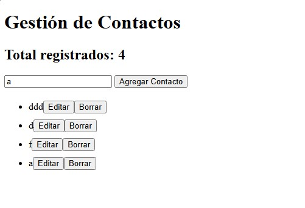

# Make It Real - DOM AND JS

This is a solution to the "DOM AND JS" challenge, and this project is intended to demonstrate that we master JS and can interact with the DOM.

## Table of contents

- [Overview](#overview)
  - [The challenge](#the-challenge)
  - [Screenshot](#screenshot)
- [My process](#my-process)
  - [Built with](#built-with)
  - [What I learned](#what-i-learned)
- [Author](#author)
- [Acknowledgments](#acknowledgments)

## Overview

Project developed in JS and HTML that reads the text of an input and adds it to a list. Each item in the list has the option to "Edit" and "Delete". Additionally, there is a counter of registered contacts.

### The challenge

Users should be able to:

- Write the HTML
- Write pure JS

### Screenshot



## My process

### Built with

- Semantic HTML5 markup
- Write JS
- Write basic comments in spanish

### What I learned

It was my first time using window.prompt

```js
let new_name = window.prompt("Actualice el nombre", contact_name);
```

## Author

- Twitter - [@davichano](https://www.twitter.com/davichano)

## Acknowledgments

I find it stimulating to embark on a new course and acquire fresh knowledge after such a long hiatus.
